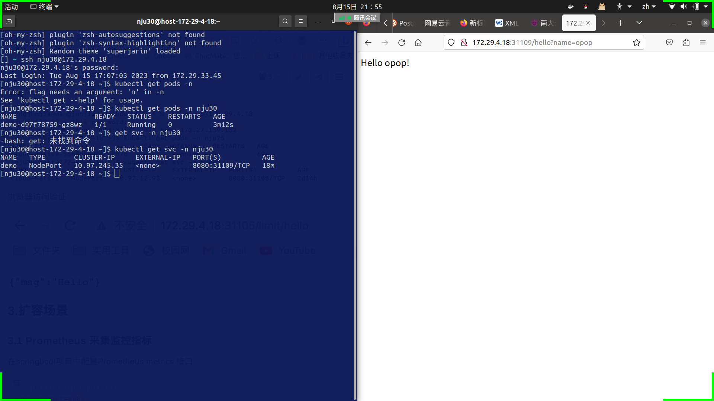

# NJU30-云原生大作业说明文档
## 1. 项目说明

| 姓名           | 学号      |
| -------------- | --------- |
| 刘子恒 |  211870018   |
| 陈宇航         | 211850104 |
| 王柏霏         | 211870213 |

项目地址：https://gitee.com/duasoihvod/Cloud-Native.git

## 2. 部署过程

### 2.1 实现一个简单REST接口

```java
@RestController
public class DemoController {

    private final RateLimiter rateLimiter = RateLimiter.create(100.0);

    @GetMapping("/hello")
    public ResponseEntity<String> hello(@RequestParam(value = "name", defaultValue = "World") String name) {
        if (rateLimiter.tryAcquire()) {
            return ResponseEntity.ok(String.format("Hello %s!", name));
        } else {
            return ResponseEntity.status(HttpStatus.TOO_MANY_REQUESTS).body("Too many requests");
        }
    }
}
```

例如，访问`http://localhost:8080/hello?name=NJU` ，将会返回：

```
Hello NJU!
```

### 2.2 限流功能

```
参考：
https://segmentfault.com/a/1190000040805974
https://juejin.cn/post/6986574899338805261
```
实现途径：
```java
private final RateLimiter rateLimiter = RateLimiter.create(100.0);
```
RateLimiter的原理类似于令牌桶，它主要由许可发出的速率来定义，如果没有额外的配置，许可证将按每秒许可证规定的固定速度分配，许可将被平滑地分发，若请求超过permitsPerSecond则RateLimiter按照每秒 1/permitsPerSecond 的速率释放许可。
RateLimiter.create(100.0) 创建了一个限流器对象，它的参数表示每秒允许通过的请求数。在这里设置为每秒最多允许 100 次请求通过。

使用Jmeter测试结果如下：


## 2.3 编写Dokcerfile并制作镜像

#### 编写Dockerfile

```dockerfile
# /demo/Dockerfile
FROM openjdk
ADD target/*.jar /application.jar
ENTRYPOINT ["java", "-jar","/application.jar"]
```

##### 解释

以opendjk为基础镜像，将target文件夹中，demo项目构建好的jar包复制到镜像中根目录下，且重命名为application.jar，然后指定容器启动时要运行`java -jar /application.jar`命令，执行该jar文件

#### 制作镜像

在`/demo`目录下

```shell
docker build -t demo:v1  .
```

即可制作镜像，名称和tag分别为demo和v1

#### 测试

执行命令

```shell
docker run -p 8080:8080  -d demo:v1
```

然后访问`http://localhost:8080/hello?name=NJU`


### 2.4 在 Kubernetes 集群上创建 Deployment 和 Service
Deployment & Service
```yaml
#/demo/jenkins/scripts/demo.yaml

apiVersion: apps/v1
kind: Deployment #对象类型
metadata:
  labels:
    app: demo
  name: demo
  namespace: nju30
spec:
  replicas: 1  #运行容器的副本数
  selector:
    matchLabels:
      app: demo
  template:
    metadata:
      annotations:
        prometheus.io/path: /actuator/prometheus
        prometheus.io/port: "8080"
        prometheus.io/scheme: http
        prometheus.io/scrape: "true"
      labels:
        app: demo
    spec:
      containers: #docker容器的配置
        - image: harbor.edu.cn/nju30/demo:18 #pull镜像的地址
          name: demo
      imagePullSecrets:
        - name: nju30-secret
---
apiVersion: v1
kind: Service
metadata:
  name: demo
  namespace: nju30
  labels:
    app: demo
spec:
  type: NodePort
  selector:
    app: demo
  ports:
    - name: tcp
      nodePort: 31109  #host's port
      protocol: TCP
      port: 8080  #service's port
      targetPort: 8080  #target pod's port
```
### 2.5 持续集成流水线和持续部署流水线
jenkins pipeline
```groovy
pipeline {
    agent none
    stages {
        stage('Clone Code') {
            agent {
                label 'master'
            }
            steps {
                echo "1.Git Clone Code"
                git branch: 'main', url: "https://gitee.com/duasoihvod/Cloud-Native.git"
            }
        }
        stage('Maven Build') {
            agent {
                docker {
                    image 'maven:latest'
                    args '-v /root/.m2:/root/.m2'
                }
            }
            steps {
                echo "2.Maven Build Stage"
                dir('/var/jenkins_home/workspace/030demo/demo') {
                    sh 'mvn -B clean package -Dmaven.test.skip=true'
                }
            }
        }
        stage('Image Build') {
            agent {
                label 'master'
            }
            steps {
                echo "3.Image Build Stage"
                dir('/var/jenkins_home/workspace/030demo/demo') {
                    sh 'docker build -f Dockerfile --build-arg jar_name=target/cloud-native-0.0.1-SNAPSHOT.jar -t demo:${BUILD_ID} . '
                    sh 'docker tag  demo:${BUILD_ID}  harbor.edu.cn/nju30/demo:${BUILD_ID}'
                }
            }
        }
        stage('Push') {
            agent {
                label 'master'
            }
            steps {
                echo "4.Push Docker Image Stage"
                dir('/var/jenkins_home/workspace/030demo/demo') {
                    sh "docker login --username=nju30 harbor.edu.cn -p nju302023"
                    sh "docker push harbor.edu.cn/nju30/demo:${BUILD_ID}"
                }

            }
        }
    }
}


node('slave') {
    container('jnlp-kubectl') {

        stage('Clone YAML') {
            echo "5. Git Clone YAML To Slave"
            git url: "https://gitee.com/duasoihvod/Cloud-Native.git", branch: 'main'
        }

        stage('YAML') {
            echo "6. Change YAML File Stage"
            sh 'sed -i "s#{VERSION}#${BUILD_ID}#g" ./demo/jenkins/scripts/demo.yaml'
        }

        stage('Deploy') {
            echo "7. Deploy To K8s Stage"
            sh 'kubectl apply -f ./demo/jenkins/scripts/demo.yaml -n nju30'
            sh 'kubectl apply -f ./demo/jenkins/scripts/demo-serviceMonitor.yaml -n nju30 --namespace=monitoring'
        }
    }
}
```
#### 流水线部署成功：


#### 部署产物与浏览器验证


#### 镜像仓库：


## 3.扩容场景

### 3.1 Prometheus 采集监控指标

在springboot项目中配置Prometheus metrics 接口


```properties
#application.properties
server.port=8080
management.endpoints.web.base-path=/actuator
management.server.port=8080
management.endpoints.web.exposure.include=prometheus
management.prometheus.metrics.export.enabled=true
management.endpoint.health.show-details=always
management.metrics.tags.application=${spring.application.name}
```


声明一个ServiceMonitor对象，在流水线中的Deploy阶段部署
```yaml
#/demo/jenkins/scripts/demo-serviceMonitor.yaml
apiVersion: monitoring.coreos.com/v1
kind: ServiceMonitor
metadata:
  labels:
    k8s-app: demo
  name: demo
  namespace: monitoring
spec:
  endpoints:
  - interval: 30s
    port: tcp
    path: /actuator/prometheus
    scheme: 'http'
  selector:
    matchLabels:
      app: demo
  namespaceSelector:
    matchNames:
    - nju30
```

在Prometheus的UI界面验证


### 3.2


1. JVM usage 容器jvm使用情况


2. container cpu usage 容器CPU使用情况


3. container memory usage 容器内存使用情况


### 3.3 压测并观察监控数据


### 3.4 手动扩容并观察监控数据
扩容前pod数为1:


更改yaml文件重新构建流水线：


扩容成功：


扩容过后的监控数据：


```java
2023 - 基于云原生技术的软件开发 - 大作业
作业说明
开发一个 Spring Boot 应用，并使用云原生功能
1. 功能要求
1.实现一个 REST 接口（简单接口即可，比如 json 串 {"msg":"hello"}）
2.接口提供限流功能，当请求达到每秒 100 次的时候，返回 429（Too many requests）
3.加分项：当后端服务有多个实例的时候（一个 Service 包含若干个 Pod），如何实现统一限流
2. DevOps 要求
1.为该项目准备 Dockerfile，用于构建镜像
2.为该项目准备 Kubernetes 编排文件，用于在 Kubernetes 集群上创建 Deployment 和 Service
3.编写 Jenkins 持续集成流水线，实现代码构建/单元测试/镜像构建功能（需要写至少一个单元测试）
4.编写 Jenkins 持续部署流水线，实现部署到 Kubernetes 集群的功能，该流水线的触发条件为持续集成流水线执行成功
5.注意：持续集成流水线和持续部署流水线也可以合二为一。
3. 扩容场景
1.为该 Java 项目提供 Prometheus metrics 接口，可以供 Prometheus 采集监控指标
2.在 Grafana 中的定制应用的监控大屏（CPU/内存/JVM）
3.使用压测工具（例如 Jmeter）对接口进压测，在 Grafana 中观察监控数据
4.通过 Kubernetes 命令进行手工扩容，并再次观察 Grafana 中的监控数据
5.加分项：使用 Kubernetes HPA 模块根据 CPU 负载做服务的 Auto Scale
分数说明
本次作业占总评 55 分，分数分配如下
1. 功能要求（20 分）
1.1 实现接口 （5 分）
1.2 实现限流功能（10 分）
1.3 实现接口访问指标（QPS），并暴露给 Prometheus（5分）
1.3 统一限流（bonus 5 分）
2. DevOps 要求（20 分）
2.1 Dockerfile 用于构建镜像（5 分）
2.2 Kubernetes 编排文件（5 分）
2.3 持续集成流水线（5 分）
2.4 持续部署流水线（5 分）
2.5 代码提交到仓库自动触发流水线（bonus 5分）
3. 扩容场景（15 分）
3.1 Prometheus 采集监控指标（5 分）
3.2 Grafana 定制应用监控大屏（5 分）
3.3 压测并观察监控数据（5 分） 
3.5 Auto Scale（bonus 10 分）
```